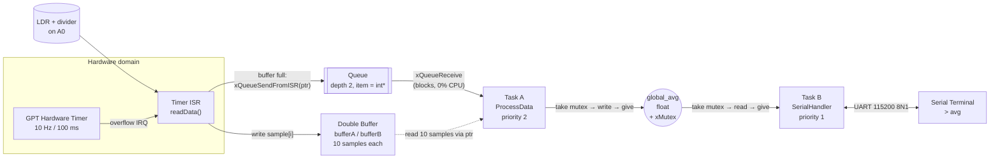
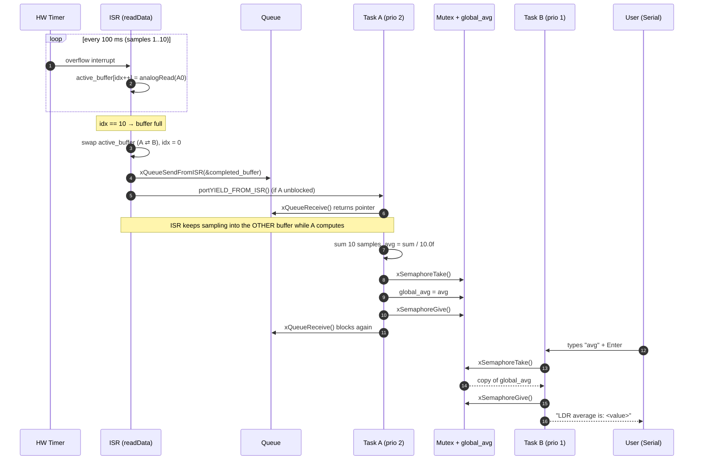
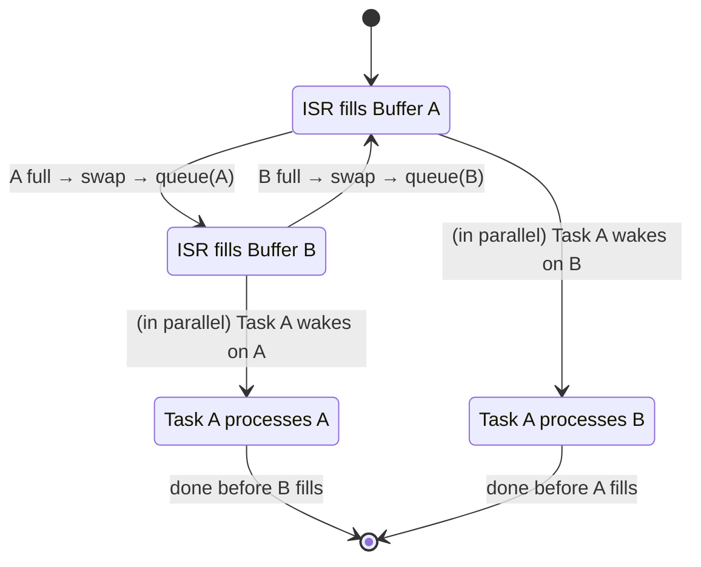
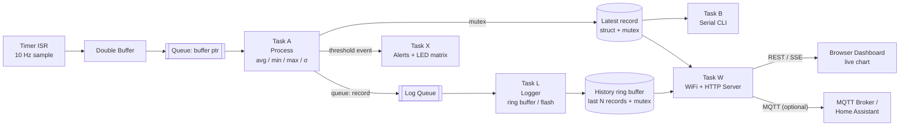

# FreeRTOS Sensor Pipeline: Interrupt-Driven Sampling, Processing & Serial Interface

> A deterministic, interrupt-driven data acquisition pipeline built on **FreeRTOS** and the **Arduino Uno R4 WiFi** (Renesas RA4M1). A hardware timer samples an analog light sensor at exactly 10 Hz, a double buffer decouples sampling from processing, a worker task computes the average, and a serial command interface exposes the result, with every shared resource protected by proper RTOS kernel objects.


-blue)

-orange)


---

## Table of Contents

1. [Overview](#1-overview)
2. [Key Features](#2-key-features)
3. [Requirements Traceability](#3-requirements-traceability)
4. [System Architecture](#4-system-architecture)
5. [Design Decisions & Rationale](#5-design-decisions--rationale)
6. [Timing & Resource Analysis](#6-timing--resource-analysis)
7. [Hardware](#7-hardware)
8. [Software Setup & Build Procedure](#8-software-setup--build-procedure)
9. [Usage](#9-usage)
10. [Code Walkthrough](#10-code-walkthrough)
11. [Verification & Test Plan](#11-verification--test-plan)
12. [Known Limitations](#12-known-limitations)
13. [Troubleshooting](#13-troubleshooting)
14. [Roadmap: WiFi Data Logger & Web Dashboard](#14-roadmap-wifi-data-logger--web-dashboard)
15. [Repository Structure](#15-repository-structure)
16. [Contributing](#16-contributing)
17. [License](#17-license)

---

## 1. Overview

Embedded systems rarely do just one thing. They sample sensors on a strict schedule, process data without missing the next sample, and stay responsive to a human or a network on the side. This project is a compact, production-style reference for exactly that pattern.

**The problem it solves**

| Concern | Naive approach | This project |
|---|---|---|
| Sampling accuracy | `delay(100)` in `loop()`, so jitter grows with other work | Hardware timer interrupt with a fixed 100 ms period |
| Processing without data loss | Compute in the sampler, so samples are missed | Double buffer: one buffer fills while the other is processed |
| Waking the worker | Polling a flag | Interrupt-safe kernel queue; the task blocks at zero CPU cost until data arrives |
| Sharing a `float` between tasks | Bare global variable (a torn-read risk) | Mutex-protected critical section |
| User interface | Blocking `Serial.read()` | Dedicated non-blocking task with a command parser |

**What it does:** Every 100 ms a timer ISR reads an LDR (light-dependent resistor) on `A0`. After 10 samples (1 second of data) the completed buffer is handed to **Task A**, which computes the mean and publishes it to a shared global. **Task B** runs a serial console: it echoes typed characters and prints the latest average when you type `avg`.

---

## 2. Key Features

- **Deterministic 10 Hz sampling** using a hardware GPT timer (`FspTimer`), independent of task scheduling
- **Lock-free producer side**: the ISR never blocks; it only uses the `FromISR` API
- **Ping-pong double buffering**, so processing overlaps with acquisition and no sample is dropped under normal load
- **Pointer-passing queue**: only an 8-byte-or-less pointer crosses the ISR/task boundary, not the data (zero-copy hand-off)
- **Mutex-protected shared state**, so the average is never observed half-written
- **Interactive serial console** with echo and a case-insensitive `avg` command
- **Priority-based preemption**: the processing task outranks the UI task
- **Clear extension path** to a WiFi data logger with a live web dashboard (see [Roadmap](#14-roadmap-wifi-data-logger--web-dashboard))

---

## 3. Requirements Traceability

The project was built against a defined challenge specification. Each requirement maps to a concrete implementation:

| # | Requirement | Implementation | Status |
|---|---|---|---|
| R1 | Hardware timer samples an ADC pin every 100 ms | `FspTimer` GPT timer at 10 Hz → `readData()` ISR calls `analogRead(A0)` | Done |
| R2 | Samples copied to a double buffer | `bufferA[10]` / `bufferB[10]` with an `active_buffer` pointer swap | Done |
| R3 | When a buffer is full, the ISR notifies Task A | `xQueueSendFromISR()` posts the completed buffer's pointer, then `portYIELD_FROM_ISR()` | Done |
| R4 | Task A wakes and averages the 10 samples; ISR may fire meanwhile | Task A blocks on `xQueueReceive()`; the ISR fills the *other* buffer during computation | Done |
| R5 | Task A updates a global `float`, protected against non-atomic writes | `global_avg` guarded by `xMutex` (`xSemaphoreTake/Give`) | Done |
| R6 | Task B echoes serial characters | Task B reads and re-prints every byte received | Done |
| R7 | `avg` command displays the global average | Task B parses a line; on `avg` it takes the mutex, copies the value, releases it, and prints | Done |

---

## 4. System Architecture

### 4.1 High-Level Data Flow



### 4.2 Execution Sequence (one full cycle)



### 4.3 Double Buffer State Machine



While the ISR fills one buffer, Task A owns the other. The two never touch the same memory at the same time, which is why the sample data itself needs **no lock**. Only the single shared `float` does.

### 4.4 Task & Interrupt Map

| Context | Name | Priority | Stack | Trigger | Blocking behaviour |
|---|---|---|---|---|---|
| ISR | `readData` | Hardware | n/a | GPT timer overflow @ 10 Hz | Never blocks (`FromISR` API only) |
| Task | `Task-A` (`TaskA_ProcessData`) | 2 (higher) | 256 words | Queue message | Blocks indefinitely (`portMAX_DELAY`) |
| Task | `Task-B` (`TaskB_SerialHandler`) | 1 (lower) | 256 words | Polls UART every 20 ms | `vTaskDelay(20 ms)` between polls |
| Kernel | Idle task | 0 | kernel-defined | n/a | Runs when A and B are both blocked |

### 4.5 Kernel Objects

| Object | Type | Purpose |
|---|---|---|
| `xqueue` | Queue (length 2, item size `sizeof(int*)`) | ISR → Task A notification *and* buffer hand-off in one primitive |
| `xMutex` | Mutex | Guards `global_avg` (Task A writes, Task B reads) |

---

## 5. Design Decisions & Rationale

### 5.1 Why a hardware timer instead of `delay()` or a software timer?
Software timers and `vTaskDelay()` run in task context and inherit scheduler jitter. A hardware timer fires from silicon at a fixed period regardless of what the CPU is doing, so the **sampling instant is deterministic**, which matters for any later signal processing (filtering, FFT, rate-of-change).

### 5.2 Why a double buffer?
The specification requires that Task A can compute *while the ISR keeps sampling*. With a single buffer, either samples are lost during computation or the data is corrupted mid-read. Ping-pong buffering gives each side exclusive ownership of one buffer at a time. A circular buffer would also work; double buffering was chosen because ownership is trivially provable (no head/tail arithmetic shared between contexts).

### 5.3 Why pass a *pointer* through a queue instead of signalling with a semaphore?
The task needs to know **which** buffer completed. A binary semaphore says "something is ready" but not "where". Sending the buffer pointer through a queue combines notification and identification into a single atomic kernel operation, and it is zero-copy: only a pointer is queued, not 40 bytes of samples. The queue depth of 2 matches the number of buffers, the maximum that can ever be in flight.

### 5.4 Why a mutex for one `float`?
On a 32-bit Cortex-M4, an aligned 32-bit store is usually a single instruction, but the C++ language and compiler make no such guarantee, and the challenge explicitly says not to assume it. The mutex makes the code **correct by construction and portable** (an 8-bit AVR or a 64-bit `double` would tear). It also future-proofs the design: in v2.0 the protected data becomes a multi-field record (`avg`, `min`, `max`, `timestamp`) where atomicity genuinely matters.

A mutex, rather than a binary semaphore, is used because it provides **priority inheritance**, which prevents priority inversion between Task A (high) and Task B (low).

### 5.5 Why is Task A higher priority than Task B?
Task A is deadline-driven: it must finish before the ISR wraps back to its buffer. Task B is human-driven and tolerant of latency. If both are ready, the RTOS always runs Task A first.

### 5.6 Why does the ISR call `portYIELD_FROM_ISR()`?
When the queue send unblocks a task of higher priority than the one that was interrupted, this call requests a context switch on ISR exit, so Task A runs *immediately* instead of waiting for the next tick. This minimises hand-off latency.

### 5.7 Why is Task B polled instead of interrupt-driven?
Human typing speed (~10 chars/s) is orders of magnitude slower than a 20 ms poll. Polling keeps the design simple, and the UART's hardware receive buffer absorbs bursts between polls. An event-driven UART is listed in the roadmap.

---

## 6. Timing & Resource Analysis

### 6.1 Timing Budget

| Parameter | Value | Note |
|---|---|---|
| Sample period | 100 ms | Hardware timer, 10 Hz |
| Samples per buffer | 10 | |
| Buffer fill time | 1000 ms | 10 × 100 ms |
| Average update rate | 1 Hz | One new average per completed buffer |
| **Task A deadline** | **< 1000 ms** | Must release the buffer before the ISR returns to it |
| Task A actual work | Microseconds | 10 integer additions + one float divide |
| Serial poll interval | 20 ms | Worst-case command latency ≈ 20 ms plus the transmit time |

The safety margin on Task A is roughly **five orders of magnitude**. Only a stuck or starved task could ever violate it (see [Known Limitations](#12-known-limitations) for detection ideas).

### 6.2 Memory Footprint

| Item | Size |
|---|---|
| `bufferA` + `bufferB` | 2 × 10 × `int` (4 B) = **80 B** |
| Queue storage | 2 × pointer (4 B) ≈ **8 B** + kernel overhead |
| Task A stack | 256 words = **1 KB** |
| Task B stack | 256 words = **1 KB** |
| Globals | `global_avg` (4 B), `buffer_index`, handles |

### 6.3 Data Characteristics

- **ADC resolution:** Arduino core default of 10-bit, giving raw values 0 to 1023 (configurable with `analogReadResolution()`)
- **Accumulator:** `long`, with no overflow risk (10 × 1023 ≪ 2³¹)
- **Averaging window:** non-overlapping, 10 samples (a boxcar filter, a simple low-pass that suppresses noise by about √10)

---

## 7. Hardware

### 7.1 Bill of Materials

| Qty | Component | Notes |
|---|---|---|
| 1 | Arduino Uno R4 WiFi | Also runs on Uno R4 Minima for v1.0 (no WiFi needed) |
| 1 | LDR (photoresistor) | Any common GL55xx-type cell |
| 1 | 10 kΩ resistor | Fixed leg of the voltage divider |
| 1 | Breadboard + jumper wires | |
| 1 | USB-C cable | Power and serial |

### 7.2 Wiring (Voltage Divider)

```
   5V (or 3.3V) ──┬── [ LDR ] ──┬── [ 10 kΩ ] ── GND
                              │
                              └──────────────────► A0
```

The voltage at `A0` rises with brightness in this configuration. Swap the LDR and resistor positions to invert the response.

> **Note:** The Uno R4 ADC reference is 5 V. If you power the divider from 3.3 V, the usable reading range shrinks accordingly.

---

## 8. Software Setup & Build Procedure

### 8.1 Prerequisites

- [Arduino IDE 2.x](https://www.arduino.cc/en/software) (or `arduino-cli`)
- **Board package:** *Arduino UNO R4 Boards* (install via Boards Manager)
- **Library:** *Arduino_FreeRTOS* (install via Library Manager)
- `FspTimer.h` ships with the R4 board package, so no separate install is needed

### 8.2 Build & Flash (Arduino IDE)

1. Clone the repository:
   ```bash
   git clone https://github.com/<your-username>/<your-repo>.git
   cd <your-repo>
   ```
2. Open `sensor-rtos/sensor-rtos.ino` in the Arduino IDE.
3. **Tools → Board →** *Arduino UNO R4 WiFi*
4. **Tools → Port →** select the board's port.
5. Click **Upload**.
6. Open **Tools → Serial Monitor**, set the baud rate to **115200** and line ending to **Newline** (or *Both NL & CR*).

### 8.3 Build & Flash (`arduino-cli`)

```bash
arduino-cli core install arduino:renesas_uno
arduino-cli lib install "Arduino_FreeRTOS"
arduino-cli compile --fqbn arduino:renesas_uno:unor4wifi sensor-rtos
arduino-cli upload  --fqbn arduino:renesas_uno:unor4wifi -p <PORT> sensor-rtos
arduino-cli monitor -p <PORT> -c baudrate=115200
```

### 8.4 Configuration Constants

| Constant | Location | Default | Meaning |
|---|---|---|---|
| `ldr_pin` | top of sketch | `A0` | Analog input pin |
| Buffer length | `bufferA/B[10]`, and the `10` in ISR & Task A | 10 | Samples per average |
| Timer frequency | `hardware_timer.begin(..., 10.0, ...)` | 10.0 Hz | Sampling rate |
| Queue length | `xQueueCreate(2, ...)` | 2 | Max buffers in flight |
| Task priorities | `xTaskCreate(...)` | A = 2, B = 1 | Scheduling order |
| Serial baud | `Serial.begin(115200)` | 115200 | Console speed |

> **Tip:** Buffer length is currently a literal in three places. A single `#define SAMPLES_PER_BUFFER 10` is a planned cleanup (see [Roadmap](#14-roadmap-wifi-data-logger--web-dashboard)).

---

## 9. Usage

### 9.1 Serial Commands

| Command | Description |
|---|---|
| `avg` | Prints the most recent 10-sample average (case-insensitive) |
| *anything else* | Echoed back; otherwise ignored |

### 9.2 Example Session

```text
Welcome to the FreeRTOS serial buffer demo
Type avg to get the average of the LDR values

hello
avg
LDR average is: 512.30
blah
```

Cover the sensor and type `avg` again to watch the value fall. Shine a torch on it and it rises. The reading updates once per second.

> **Note:** Before the first 10 samples are collected (about 1 second after boot), `avg` reports `0.00`, the initial value of `global_avg`.

---

## 10. Code Walkthrough

### 10.1 Timer Setup (`setup()`)

```cpp
uint8_t timer_type = GPT_TIMER;
int8_t  t_index = FspTimer::get_available_timer(timer_type);

if (t_index < 0) {                       // fall back to a PWM-reserved timer
  t_index = FspTimer::get_available_timer(timer_type, true);
  FspTimer::force_use_of_pwm_reserved_timer();
}

hardware_timer.begin(TIMER_MODE_PERIODIC, timer_type, t_index,
                     10.0, 50.0, readData, nullptr);   // 10 Hz, 50 % duty
hardware_timer.setup_overflow_irq();
hardware_timer.open();
hardware_timer.start();
```

The code asks the FSP layer for a free General PWM Timer (GPT) channel, configures it as periodic at 10 Hz, attaches `readData` as the overflow callback, then starts it.

### 10.2 The ISR (`readData`)

```cpp
active_buffer[buffer_index] = analogRead(ldr_pin);
buffer_index++;

if (buffer_index == 10) {
  buffer_index = 0;
  int *completed_buffer = active_buffer;
  active_buffer = (active_buffer == bufferA) ? bufferB : bufferA;   // swap

  BaseType_t xHigherPriorityTaskWoken = pdFALSE;
  xQueueSendFromISR(xqueue, &completed_buffer, &xHigherPriorityTaskWoken);
  portYIELD_FROM_ISR(xHigherPriorityTaskWoken);
}
```

Order matters: the ISR **swaps first, then posts**, so by the time Task A can see the pointer, the ISR is already writing to the other buffer. `active_buffer` and `buffer_index` are `volatile` because they are shared between the ISR and the main context.

### 10.3 Task A: Processing

```cpp
xQueueReceive(xqueue, &buf_to_process, portMAX_DELAY);   // sleep until data
long sum = 0;
for (int i = 0; i < 10; i++) sum += buf_to_process[i];
float calculated_avg = (float)sum / 10.0;

xSemaphoreTake(xMutex, portMAX_DELAY);
global_avg = calculated_avg;                              // critical section
xSemaphoreGive(xMutex);
```

The computation happens **outside** the critical section. The mutex is held only for the single store, keeping the lock time minimal.

### 10.4 Task B: Serial Interface

Task B accumulates characters into a line buffer, echoing each one. On `\n` or `\r` it trims the line, and on a case-insensitive match with `avg` it copies `global_avg` under the mutex and prints it. Reading into a local variable **before** printing avoids holding the mutex during slow serial I/O.

---

## 11. Verification & Test Plan

| ID | Test | Method | Expected result |
|---|---|---|---|
| T1 | Sample rate | Toggle a spare GPIO in the ISR; measure on a scope or logic analyser | 10.0 Hz ± crystal tolerance, with a stable period |
| T2 | Average correctness | Feed a fixed voltage from a resistor divider or a potentiometer | `avg` ≈ expected ADC count (±1 LSB noise) |
| T3 | Sensor response | Cover / illuminate the LDR | Average moves monotonically with light |
| T4 | Echo | Type arbitrary text | Every character is returned |
| T5 | `avg` case-insensitivity | Send `avg`, `AVG`, `Avg` | All return the average |
| T6 | Unknown command | Send `blah` | Echoed, no crash, no output |
| T7 | Concurrency soak | Leave running 24 h while spamming `avg` | No resets, no stalls, no garbled values |
| T8 | Stack headroom | Call `uxTaskGetStackHighWaterMark()` for each task | Comfortable free margin on both stacks |
| T9 | Overrun behaviour | Insert `vTaskDelay(1500)` in Task A (test only) | Confirm and document the failure mode (see Limitations) |

---

## 12. Known Limitations

These are documented deliberately. Knowing where a design's edges are is part of engineering it.

| # | Limitation | Impact | Mitigation planned |
|---|---|---|---|
| L1 | `analogRead()` is called inside the ISR | It is a blocking call, so the ISR is longer than ideal (acceptable at 10 Hz, poor at high rates) | Move to hardware-triggered ADC with DTC/DMA transfer (v1.1) |
| L2 | ISR-safe RTOS calls require the timer IRQ priority to be compatible with the FreeRTOS port's interrupt-priority ceiling | A mis-set priority can cause hard-to-trace faults | Verify and explicitly set the priority of the timer IRQ (v1.1) |
| L3 | No overrun detection: if Task A stalls for more than 1 s, the ISR silently overwrites a buffer, and a full queue drops the send | Silent data loss is possible under fault conditions | Count and report dropped buffers (v1.1) |
| L4 | Task B uses the Arduino `String` class | Heap fragmentation on long runs | Fixed-size `char[]` command buffer (v1.1) |
| L5 | Non-overlapping 1 Hz average only | No trend, min/max or smoothing | Rolling statistics (v1.2) |
| L6 | Raw ADC counts, not physical units | Not directly comparable across sensors or supply voltages | Calibration to lux/percent (v1.2) |
| L7 | Buffer length hard-coded in several places | Easy to introduce a mismatch when editing | Single `#define` (v1.1) |

---

## 13. Troubleshooting

| Symptom | Likely cause | Fix |
|---|---|---|
| Compile error: `Arduino_FreeRTOS.h` not found | Library not installed | Install *Arduino_FreeRTOS* from the Library Manager |
| Compile error: `FspTimer.h` not found | Wrong board selected | Select *Arduino UNO R4 WiFi/Minima* |
| Nothing in the Serial Monitor | Wrong baud rate | Set 115200 |
| Typed text appears with no response to `avg` | Line ending not sent | Set the monitor to *Newline* or *Both NL & CR* |
| `avg` always `0.00` | Fewer than 10 samples collected yet, or timer failed to start | Wait 1 s; check that `t_index >= 0` |
| Average stuck at 0 or 1023 | LDR or divider wired wrongly, or floating pin | Re-check wiring against [Section 7.2](#72-wiring-voltage-divider) |
| Random resets or freezes | Stack overflow | Raise the stack sizes; check with `uxTaskGetStackHighWaterMark()` |

---

## 14. Roadmap: WiFi Data Logger & Web Dashboard

The Uno R4 WiFi carries an ESP32-S3 WiFi/Bluetooth co-processor alongside the RA4M1, plus a built-in 12×8 LED matrix and real-time clock. v2.0 turns this project from a serial demo into a **networked IoT data logger**.

### 14.1 Target Architecture (v2.0)



### 14.2 Proposed Web API

| Method | Endpoint | Description |
|---|---|---|
| `GET` | `/` | Single-page dashboard (HTML/JS served from flash) |
| `GET` | `/api/latest` | Latest record as JSON: `{seq, ts, avg, min, max}` |
| `GET` | `/api/history?n=300` | Last *n* records as JSON |
| `GET` | `/api/stats` | Uptime, sample count, dropped buffers, free heap, task stack watermarks |
| `GET` | `/api/export.csv` | Download the history as CSV |
| `GET` | `/events` | Server-Sent Events stream for live updates without polling |
| `POST` | `/api/config` | Change threshold, sample window and units (persisted) |

### 14.3 Feature Roadmap

**v1.1: Hardening (robustness)**
- [ ] Replace the magic number `10` with `SAMPLES_PER_BUFFER`
- [ ] Add overrun and dropped-buffer counters
- [ ] Replace `String` with a fixed `char[]` command buffer
- [ ] Verify and set the timer IRQ priority against the FreeRTOS interrupt ceiling
- [ ] Add stack high-water-mark monitoring
- [ ] Enable the hardware watchdog (WDT) with a task-liveness check
- [ ] Explore hardware-triggered ADC + DTC to remove `analogRead()` from the ISR

**v1.2: Signal quality & CLI**
- [ ] Publish a full record (`avg`, `min`, `max`, standard deviation, sequence number) instead of a bare float
- [ ] Rolling and exponential moving averages
- [ ] Calibration to lux or percent, with values stored in the R4's data-flash EEPROM
- [ ] Richer CLI: `help`, `status`, `stats`, `rate <hz>`, `reset`
- [ ] Threshold alarms with hysteresis (avoid chatter near the limit)

**v2.0: WiFi data logger (headline feature)**
- [ ] WiFi station mode via `WiFiS3`, with credentials kept in a git-ignored `arduino_secrets.h`
- [ ] Embedded HTTP server and the REST/SSE API above
- [ ] Responsive dashboard with a live chart, current value gauge, min/max and connection status
- [ ] Timestamps from the on-chip RTC, synchronised over NTP
- [ ] mDNS, so the device is reachable at `http://sensor-logger.local`
- [ ] In-RAM history ring buffer (mutex-protected) with CSV export
- [ ] WiFi auto-reconnect with exponential backoff, without ever blocking the sampling path

**v3.0: Standout extras**
- [ ] MQTT publishing with Home Assistant auto-discovery
- [ ] Persistent logging to an SD card or external flash
- [ ] Onboard 12×8 LED-matrix live bar graph of light level
- [ ] Captive-portal WiFi provisioning (no hard-coded credentials)
- [ ] Multi-sensor support (temperature, humidity) via a sensor-driver abstraction
- [ ] Over-the-air (OTA) firmware updates
- [ ] Host-side unit tests for the averaging and statistics logic, plus a GitHub Actions CI pipeline running `arduino-cli compile`
- [ ] Authentication on the write endpoints, and rate limiting

### 14.4 Design Rules for the WiFi Extension

These keep the real-time guarantees intact when networking is added:

1. **Sampling never waits on the network.** The ISR and Task A stay at the highest priorities; WiFi and HTTP tasks run below them.
2. **Share records, not fragments.** Replace the lone `float` with a struct protected by the same mutex pattern, so the dashboard never sees a half-updated record.
3. **Decouple with queues.** Task A pushes records to a logger queue and does not care whether the consumer is slow.
4. **Bound everything.** Fixed-size buffers, no unbounded `String` growth, and no allocation in ISRs.

---

## 15. Repository Structure

Suggested layout for publishing:

```text
.
├── sensor-rtos/
│   └── sensor-rtos.ino        # v1.0 firmware
├── docs/
│   ├── architecture.png       # system diagram
│   ├── wiring.png             # breadboard / schematic
│   └── serial-demo.png        # terminal screenshot
├── hardware/
│   └── bom.md                 # bill of materials
├── .github/
│   └── workflows/
│       └── compile.yml        # CI: arduino-cli compile (planned)
├── CHANGELOG.md
├── LICENSE
└── README.md
```

---

## 16. Contributing

Contributions, issues and feature ideas are welcome.

1. Fork the repository
2. Create a feature branch: `git checkout -b feature/my-improvement`
3. Commit with a clear message: `git commit -m "Add overrun counter"`
4. Push and open a Pull Request

Please keep interrupt handlers short and non-blocking, use only `FromISR` APIs inside ISRs, and describe how you tested timing-sensitive changes.

---

## 17. License

Released under the **MIT License**. See [`LICENSE`](LICENSE) for details.

---

## Acknowledgements

- FreeRTOS kernel and the `Arduino_FreeRTOS` port
- Arduino UNO R4 core and the Renesas FSP timer layer
- The "Introduction to RTOS" learning series, for the original interrupt/queue/mutex challenge that inspired this project

<sub>Author: **[Your Name]** · Contact: **[your email or GitHub profile]**</sub>
