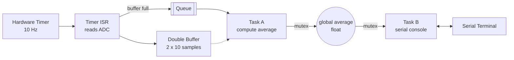

# FreeRTOS Sensor Pipeline

An interrupt-driven sampling, processing and serial interface system built on **FreeRTOS** and the **Arduino Uno R4 WiFi**.

A hardware timer samples a light sensor (LDR) every 100 ms, a double buffer hands the data to a worker task that computes the average, and a serial console lets you read the result with the `avg` command.


---

## Features

- Hardware timer interrupt samples the ADC at exactly **10 Hz**
- **Double buffer**, so one buffer fills while the other is processed
- **Task A** wakes when a buffer is full and computes the average of 10 samples
- **Mutex-protected** global average, safe to share between tasks
- **Task B** serial console: echoes typed characters and prints the average on `avg`

---

## How It Works



1. The timer ISR reads the LDR on `A0` every 100 ms and stores the value in the active buffer.
2. After 10 samples the ISR swaps to the other buffer and sends the full buffer to Task A through a queue.
3. Task A calculates the average and writes it to the global variable, protected by a mutex.
4. Task B reads the global (also under the mutex) when you type `avg`.

| Component | Type | Priority |
|---|---|---|
| Timer ISR | Hardware interrupt | Highest |
| Task A | Processing task | 2 |
| Task B | Serial console task | 1 |

---

## Hardware

| Qty | Component |
|---|---|
| 1 | Arduino Uno R4 WiFi or Minima|
| 1 | LDR (photoresistor) |
| 1 | 10 kΩ resistor |
| 1 | Breadboard and jumper wires |

**Wiring (voltage divider):**

```
5V ──[ LDR ]──┬──[ 10 kΩ ]── GND
              │
              └──► A0
```

---

## Getting Started

**Requirements**
- Arduino IDE 2.x
- *Arduino UNO R4 Boards* package (Boards Manager)
- *Arduino_FreeRTOS* library (Library Manager)

**Steps**
1. Clone the repository:
   ```bash
   git clone https://github.com/sushan-kumar/rtos-double-buffer-adc.git
   ```
2. Open `sensor-rtos/sensor-rtos.ino` in the Arduino IDE.
3. Select **Tools → Board → Arduino UNO R4 WiFi** and choose the port.
4. Click **Upload**.
5. Open the Serial Monitor at **115200 baud** with line ending set to **Newline**.

---

## Usage

| Command | Description |
|---|---|
| `avg` | Prints the latest 10-sample average |
| anything else | Echoed back |

```text
> hello
> avg
LDR average is: 512.30
> blah
```

The average updates once per second. Cover or light the sensor to see it change.

---

## Future Ideas

Planned next step: use the **WiFi of the Uno R4 WiFi** to turn this into a data logger with a web dashboard.

- Live web page showing the current value and a chart of recent readings
- Simple REST endpoint (`/api/latest`) returning the data as JSON
- Timestamps from the on-board RTC
- CSV export of logged data
- MQTT / Home Assistant integration

---

## Repository Structure

```text
.
├── sensor-rtos/
│   └── sensor-rtos.ino
├── LICENSE
└── README.md
```

---

## License

MIT License. See [`LICENSE`](LICENSE).

<sub>Author: sushan-kumar </sub>
